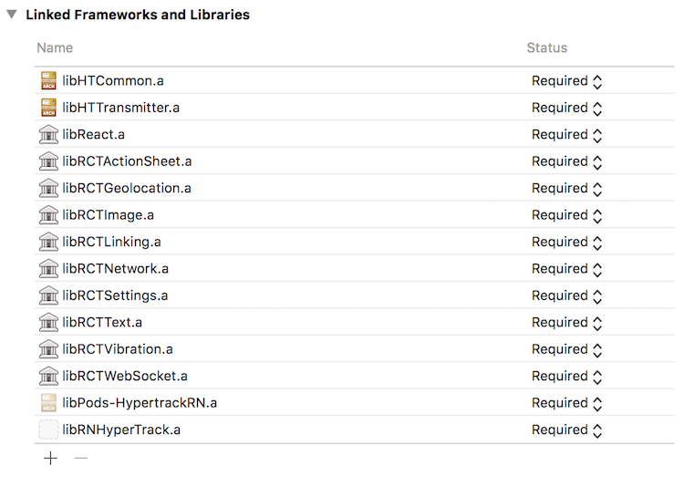

# react-native-hypertrack
React native module for hypertrack-android and hypertrack-ios SDKs. Methods in the Driver SDK are covered in the current release. The [example-react-native](https://github.com/hypertrack/example-react-native) app is built on top of this module.

[](http://slack.hypertrack.io) [](https://badge.fury.io/js/react-native-hypertrack)

## What's new in v1.x
The v1.x wrapper is built for HyperTrack v3, and will not work with the older SDKs. There will be breaking changes if you are upgrading - please refer to [docs.hypertrack.com](https://docs.hypertrack.com).

## Getting started
In your project directory, install and link the module package from npm.
```
$ npm install react-native-hypertrack --save
$ react-native link react-native-hypertrack
```

If you are using an older version of React Native that does not support `link`, you can [manually link](https://facebook.github.io/react-native/docs/linking-libraries-ios.html) libraries.

### Android setup
To use the HyperTrack Android SDKs, the following urls need to be added to your `android/build.gradle` file. This will configure the repository urls for the SDKs.

```
allprojects {
    repositories {
        ...
        maven { url 'http://hypertrack-android-sdk.s3-website-us-west-2.amazonaws.com/' }
        maven { url 'https://repo.eclipse.org/content/repositories/paho-releases/' }
    }
}
```

If you have some issues with Android, some common troubleshooting is [here](android-troubleshooting.md).

### iOS setup
1. The native iOS SDKs need to be setup using Cocoapods. In your project's `ios` directory, create a Podfile.
    ```
    $ cd ios
    $ pod init
    ```

2. Edit the Podfile to include `HyperTrack` as a dependency for your project, and then install the pod with `pod install`.
    ```
    use_frameworks!
    platform :ios, '9.0'

    target 'AwesomeProject' do
      pod 'HyperTrack'
    end
    ```

3. Now, open the iOS project with the `.xcworkspace` file in Xcode, and add the native SDK `.a` files in the linked frameworks and libraries section. You need to add *libHTTransmitter.a*, *libHTCommon.a*, *libMQTTClient.a*.


## Usage

#### 1. Initialize the SDK

```javascript
 import RNHyperTrack from 'react-native-hypertrack';
 ...

 export default class MyApp extends Component {
   constructor() {
     super();
     // Initialize HyperTrack wrapper
     RNHyperTrack.initialize("YOUR_PUBLISHABLE_KEY");
   }
 }
  ...
```

#### 2. Set or create user
If you have a [user](https://docs.hypertrack.com/v3/api/entities/user.html) that is to be associated with this device, set the user id.
```javascript
RNHyperTrack.setUserId("YOUR_USER_ID");
```

In case you do not have a user, you can create a new user. Calling this will automatically set the user in the SDK.

```javascript
RNHyperTrack.createUser("USER_NAME", (success) => {}, (error) => {});
```

#### 3. Start tracking
To start tracking on the SDK, use the following method.

```javascript
RNHyperTrack.startTracking((success) => {}, (error) => {});
```

#### Stop tracking
To stop tracking on the SDK, use the following method.

```javascript
RNHyperTrack.stopTracking();
```

#### 5. Completing an action
If you are using actions for your use-case, you can complete actions through the SDK.

```javascript
RNHyperTrack.completeAction("YOUR_ACTION_ID");
```

## Documentation
The HyperTrack documentation is at [docs.hypertrack.com](http://docs.hypertrack.com/).

## Support
For any questions, please reach out to us on [Slack](http://slack.hypertrack.io/) or on help@hypertrack.io. Please create an [issue](https://github.com/hypertrack/hypertrack-cordova/issues) for bugs or feature requests.

## Acknowledgements
Thanks to [react-native-create-library](https://github.com/frostney/react-native-create-library) which saved a few hours.
