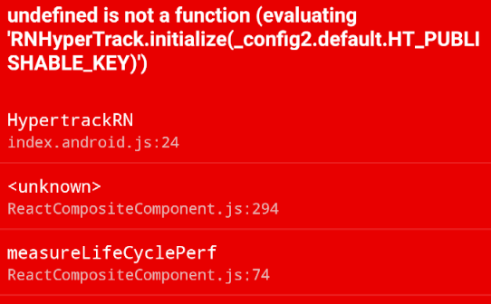

## Common issues in Android
### Undefined methods


1. Include this module in your `android/settings.gradle`:

    ```
    include ':react-native-hypertrack'
    project(':react-native-hypertrack').projectDir = new File(rootProject.projectDir, '../node_modules/react-native-hypertrack/android')
    include ':app'
    ```

2. Add a dependency to your app build in `android/app/build.gradle`:

    ```
    dependencies {
       ...
       compile project(':react-native-hypertrack')
    }
    ```

3. Change your main application to add a new package, in `android/app/src/main/.../MainApplication.java`:

    ```java
    import io.hypertrack.RNHyperTrackPackage; // Add new import

    public class MainApplication extends Application implements ReactApplication {
      ...

      @Override
      protected List<ReactPackage> getPackages() {
        return Arrays.<ReactPackage>asList(
          new MainReactPackage(),
          new RNHyperTrackPackage() // Add the package here
        );
      }
    }
    ```

### Play services not found
```
{ error: 'java.lang.IllegalStateException: Cannot start trip. Please update play services' }
```

To fix this, open the Android SDK Manager to ensure that Google APIs are installed for the local Android SDK installation.

### Location not working
```
{ error: 'java.lang.IllegalArgumentException: Please verify Location Settings. Have you enabled Location and set Location Mode to High Accuracy ?' }
```

To fix this, open location settings on your Android phone, and ensure that it is enabled and set at high accuracy.
